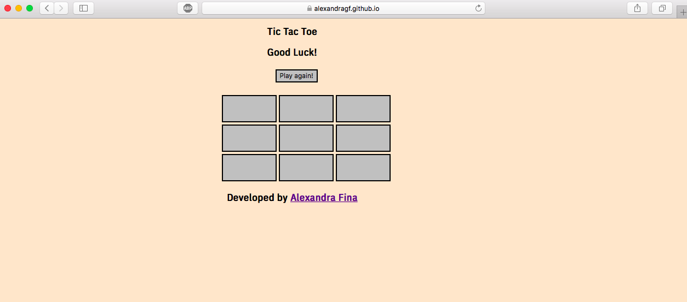
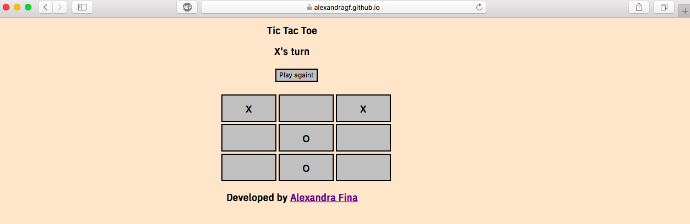
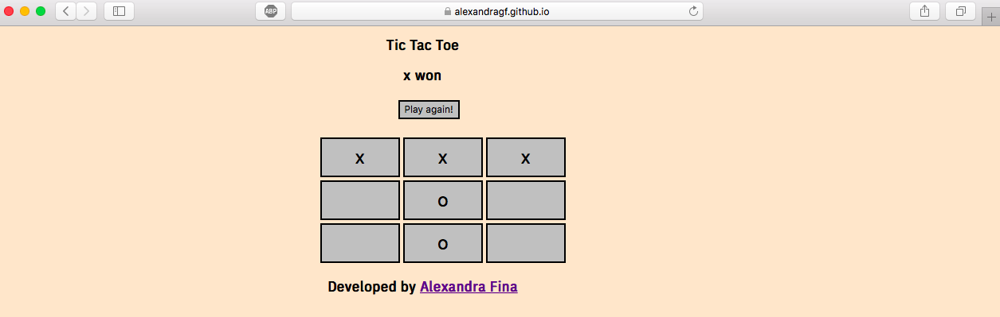

Tic Tac Toe - JavaScript

## How to play using command line

1. On your command line type ``` git clone git@github.com:AlexandraGF/ticTacToeJs.git ```
2. Then change the directory by typing ``` cd ticTacToeJs/docs ```
3. Type ``` open index.html ``` and your browser will open the file.
4. Enjoy!

## How to play directly on the internet

1. Click on the link ``` [Tic Tac Toe Game](https://alexandragf.github.io/ticTacToeJs/) ```
2. Enjoy!

## How to run the tests (Jasmine testing)

1. On your command line type ``` git clone git@github.com:AlexandraGF/ticTacToeJs.git```
2. Then change the directory by typing ``` cd ticTacToeJs.git/spec ```
3. Type ``` open SpecRunner.html ``` and your browser will open the passing tests.

## Screenshots from the Tic Tac Toe Game




